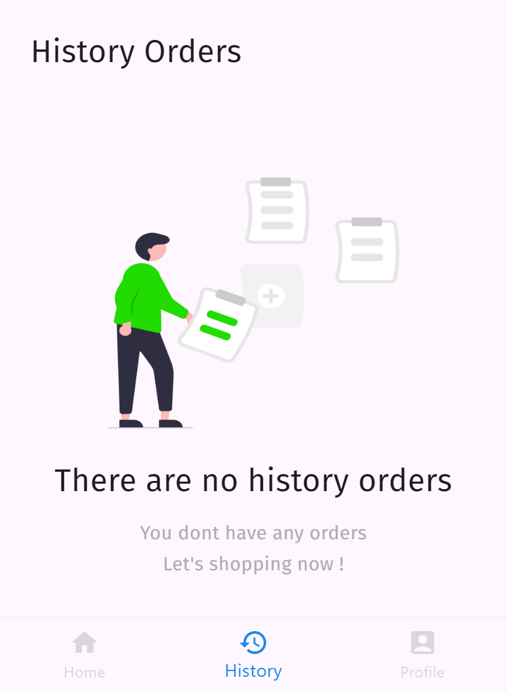

# Medical Healthcare

A new Flutter project for a medicine application.

## Overview

This Flutter application, **Medical Healthcare**, is designed to facilitate the management of medicine-related activities. The app includes various pages such as:

- Get Started
- Login Page
- Register Page
- Main Page
- Cart Page
- History Order Page
- Profile Page
- Search Page

The project utilizes a custom API built with PHP and a MySQL database for backend operations.

## Screenshots

Below are some screenshots to give you an idea of the app's user interface:

| Get Started | Login Page | Register Page |
|-------------|------------|---------------|
|  |  |  |

| Main Page | Cart Page (Empty) | Product Detail Page |
|-----------|--------------------|---------------------|
|  |  |  |

| Cart Page | Profile Page | History Order Page |
|-----------|--------------|--------------------|
|  |  |  |

| Search Page | Empty History Order | Success Checkout |
|-------------|---------------------|-----------------|
|  |  |  |

## Backend and Assets

To get the assets folder and the backend code for the API using PHP, please send a direct message (DM) on Instagram to [@dvralz_](https://www.instagram.com/dvralz_/).

## Getting Started

This project is a starting point for a Flutter application.

### Resources

Here are a few resources to help you get started with Flutter:

- [Lab: Write your first Flutter app](https://docs.flutter.dev/get-started/codelab)
- [Cookbook: Useful Flutter samples](https://docs.flutter.dev/cookbook)

For additional help with Flutter development, check out the [online documentation](https://docs.flutter.dev/), which provides tutorials, samples, guidance on mobile development, and a comprehensive API reference.

---

We hope this project serves as a solid foundation for your Flutter development journey. Happy coding!